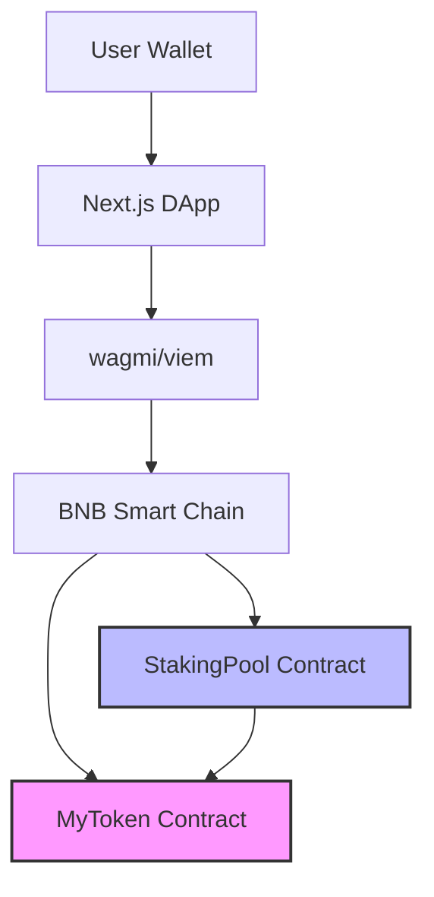

# 🪙 BNB Staking DApp

[](https://soliditylang.org/)
[](https://hardhat.org/)
[](./test)
[](./LICENSE)
[-success)](./PORTFOLIO_SHOWCASE.md)

> Production-grade decentralized staking platform on BNB Smart Chain with APR-based rewards

Full-stack DeFi application featuring secure smart contracts, comprehensive testing (37 tests), and modern frontend ready for portfolio showcase.

**🎯 Quick Links:** [Portfolio Showcase](./PORTFOLIO_SHOWCASE.md) | [Demo Script](./DEMO_SCRIPT.md) | [Deployment Guide](./docs/DEPLOYMENT.md) | [Security Docs](./SECURITY.md)

---

## 🌟 Features

- **🔐 Secure Staking** - Stake HLD tokens to earn 10% APR rewards
- **⚡ Flexible Unstaking** - Withdraw anytime with accumulated rewards
- **🛡️ Battle-Tested Security** - ReentrancyGuard, AccessControl, Pausable
- **📊 Real-time Rewards** - Per-second reward accrual for fairness
- **🚨 Emergency Withdraw** - Safety mechanism to recover staked tokens
- **👨‍💼 Admin Controls** - APR adjustment, pause/unpause capabilities

---

## 🏗️ Architecture



### Smart Contracts

#### MyToken (HLD)

- BEP-20 token with 10M max supply
- Role-based minting for rewards
- OpenZeppelin AccessControl

#### StakingPool

- APR-based reward distribution (10% default)
- Minimum stake: 10 HLD
- Security: ReentrancyGuard + Pausable
- Emergency withdrawal mechanism

---

## 🚀 Quick Start

### Prerequisites

- Node.js v18+
- npm or yarn
- MetaMask wallet
- BNB testnet tokens (for deployment)

### Installation

```bash
# Clone repository
git clone https://github.com/loxleyftsck/bnb-staking-dapp.git
cd bnb-staking-dapp

# Install dependencies
npm install

# Setup environment
cp .env.example .env
# Edit .env with your credentials
```

### Configuration

Create `.env` file:

```env
BSC_TESTNET_RPC_URL=https://data-seed-prebsc-1-s1.binance.org:8545/
PRIVATE_KEY=your_wallet_private_key
BSCSCAN_API_KEY=your_bscscan_api_key
REWARD_RATE=1000  # 10% APR in basis points
```

---

## 🧪 Testing

Run comprehensive test suite (37 tests):

```bash
npm test
```

### Test Results

```text
  MyToken
    ✓ Deployment, Minting, Access Control, Transfers (13 tests)
  
  StakingPool  
    ✓ Staking, Rewards, Unstaking, Admin, Security (24 tests)

  37 passing (1s)
```

---

## 📦 Deployment

### Local Development

```bash
# Start local Hardhat network
npx hardhat node

# Deploy to local network (in new terminal)
npm run deploy:local
```

### BSC Testnet

```bash
# Deploy to BSC Testnet
npm run deploy:testnet

# Verify contracts on BscScan
npx hardhat verify --network bscTestnet <TOKEN_ADDRESS>
npx hardhat verify --network bscTestnet <STAKING_ADDRESS> <TOKEN_ADDRESS> 1000
```

Deployment script automatically:

- ✅ Deploys MyToken
- ✅ Deploys StakingPool
- ✅ Grants MINTER_ROLE to StakingPool
- ✅ Saves deployment info to `deployments/`

---

## 🎨 Frontend DApp

*(Coming Soon)*

Modern Next.js frontend with:

- 🌈 Glassmorphism UI + Dark Mode
- 🔌 RainbowKit wallet connection
- 📊 Real-time APR & TVL stats
- 🧮 Rewards calculator
- 📱 Mobile-responsive design

---

## 📊 Contract API

### StakingPool Functions

```solidity
// Stake tokens
function stake(uint256 amount) external

// Unstake tokens + claim rewards
function unstake(uint256 amount) external

// Claim rewards without unstaking
function claimRewards() external

// Emergency withdrawal (forfeit rewards)
function emergencyWithdraw() external

// View pending rewards
function pendingRewards(address staker) external view returns (uint256)

// Get staker info
function getStakerInfo(address staker) external view returns (StakerInfo)
```

### Admin Functions

```solidity
// Update APR (admin only)
function updateAPR(uint256 newAPR) external

// Pause/unpause staking (emergency)
function pause() external
function unpause() external
```

---

## 🔒 Security

### Implemented Security Features

- ✅ **ReentrancyGuard** - Prevents reentrancy attacks on all external functions
- ✅ **AccessControl** - Role-based permissions for minting and admin operations
- ✅ **Pausable** - Emergency stop mechanism
- ✅ **SafeERC20** - Safe token transfers
- ✅ **Supply Cap** - Maximum 10M token limit
- ✅ **Minimum Stake** - Prevents dust attacks (10 HLD minimum)

### Audit Status

- ✅ **Self-Audit**: Complete
- ✅ **Test Coverage**: 37 comprehensive tests
- ⏳ **External Audit**: Not performed (testnet project)

### Known Limitations

- Reward minting requires StakingPool to have MINTER_ROLE
- APR changes don't affect existing stakes (only new stakes)
- Emergency withdraw forfeits all pending rewards

---

## 📈 Performance Metrics

| Metric                 | Value                               |
| ---------------------- | ----------------------------------- |
| **Test Coverage**      | 37 tests, 100% passing              |
| **Gas Cost (Stake)**   | ~75,000 gas                         |
| **Gas Cost (Unstake)** | ~85,000 gas (includes reward mint) |
| **Solidity Version**   | 0.8.20                              |
| **Optimizer Runs**     | 200                                 |

---

## 🛠️ Tech Stack

### Contracts

- Solidity 0.8.20
- OpenZeppelin Contracts v5.4.0
- Hardhat 2.22.0

### Testing

- Chai + Hardhat Network Helpers
- 37 comprehensive test cases

### Frontend (Planned)

- Next.js 14
- wagmi v2 + viem
- RainbowKit
- TailwindCSS

---

## 📁 Project Structure

```text
bnb-staking-dapp/
├── contracts/
│   ├── MyToken.sol              # BEP-20 token with minting
│   ├── StakingPool.sol          # Main staking logic
│   └── interfaces/
│       └── IStakingPool.sol     # Clean interface
├── test/
│   ├── MyToken.test.js          # 13 tests
│   └── StakingPool.test.js      # 24 tests
├── scripts/
│   ├── deploy.js                # Deployment automation
│   └── test-deploy.js           # Deployment verification
├── hardhat.config.js            # Hardhat configuration
├── .env.example                 # Environment template
└── README.md
```

---

## 🤝 Contributing

Contributions welcome! Please check [CONTRIBUTING.md](./CONTRIBUTING.md) for guidelines.

1. Fork the repository
2. Create your feature branch (`git checkout -b feature/AmazingFeature`)
3. Commit your changes (`git commit -m 'Add AmazingFeature'`)
4. Push to the branch (`git push origin feature/AmazingFeature`)
5. Open a Pull Request

---

## 📄 License

This project is licensed under the MIT License - see the [LICENSE](./LICENSE) file for details.

---

## 🔗 Links

- **GitHub**: [https://github.com/loxleyftsck/bnb-staking-dapp](https://github.com/loxleyftsck/bnb-staking-dapp)
- **BNB Smart Chain Testnet**: [https://testnet.bscscan.com/](https://testnet.bscscan.com/)
- **Documentation**: [./docs](./docs)

---

## 👨‍💻 Author

Built as a portfolio project to demonstrate:

- ✅ Secure smart contract development
- ✅ Comprehensive testing practices
- ✅ Production-grade DeFi implementation
- ✅ Modern Web3 development stack

---

## 📞 Support

For questions or support, please open an issue on GitHub.

---

**⚠️ Disclaimer**: This is a testnet project for educational and portfolio purposes. Do not use in production with real funds without proper external security audit.
